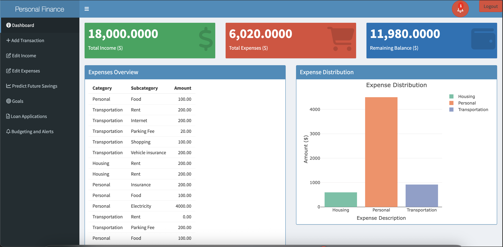
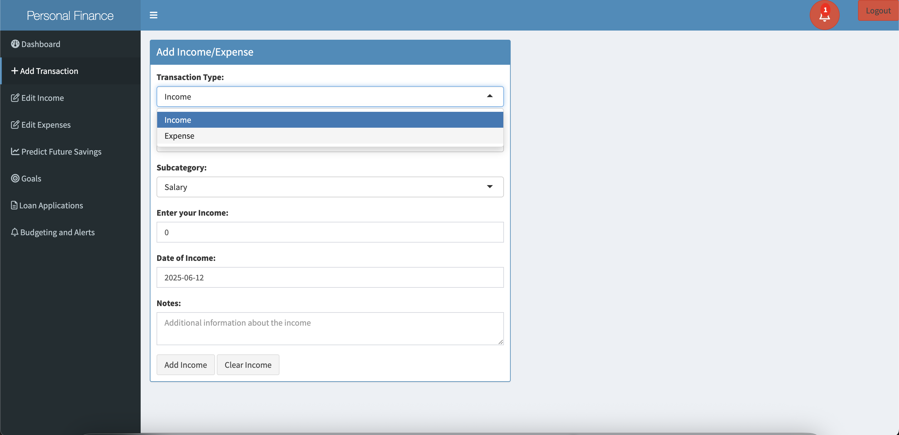
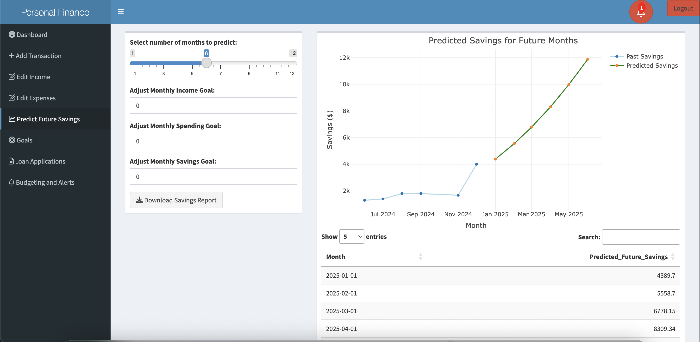
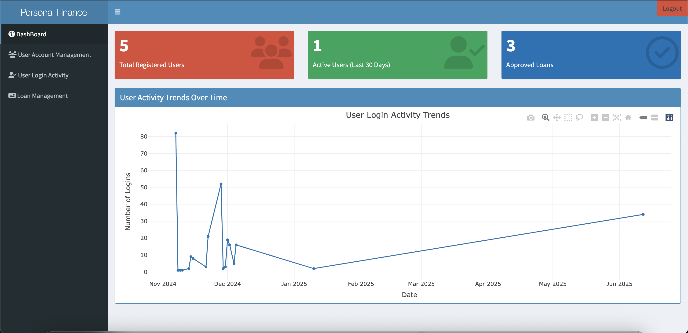

# 💰 Personal Finance Tracker - Shiny App

This is a robust and interactive **Personal Finance Tracker** built using **R Shiny**, which allows users to manage income, expenses, financial goals, budgeting, and loan applications with dedicated dashboards for Admins, Financial Advisors, and Bank Representatives.

---

## 📌 Features

- 🧾 Add, edit, and view income and expenses
- 📊 Visualizations: Expense distribution, savings trends, income vs expense
- 📉 Predict future savings using polynomial regression
- 🎯 Set and track financial goals
- 🏦 Apply for and manage loans
- 📅 Monthly budgeting and alerts
- 👥 Role-based access: Users, Admins, Advisors, Bank Reps
- 📈 Admin dashboard to monitor user activity and loan statuses
- 🔔 Budget alert system with notifications

---

## 🧱 Tech Stack

- **Frontend**: R Shiny, shinydashboard, shinyjs, plotly, DT
- **Backend**: MySQL (local)
- **Authentication**: Role-based login system for Users, Admins, Advisors, and Bank Representatives
- **Dependencies**:
  - `shiny`, `shinydashboard`, `shinyjs`, `plotly`, `DBI`, `RMySQL`, `DT`, `dplyr`, `tidyr`, `lubridate`

---

## 📸 Screenshots

### 🏠 Dashboard


### ➕ Add Income/Expense


### 💡 Predicted Savings


### 🧑‍💼 Admin Dashboard


## 🚀 Getting Started

### 1. Clone the repository

```bash
git clone https://github.com/yourusername/shiny-finance-tracker.git
cd shiny-finance-tracker
